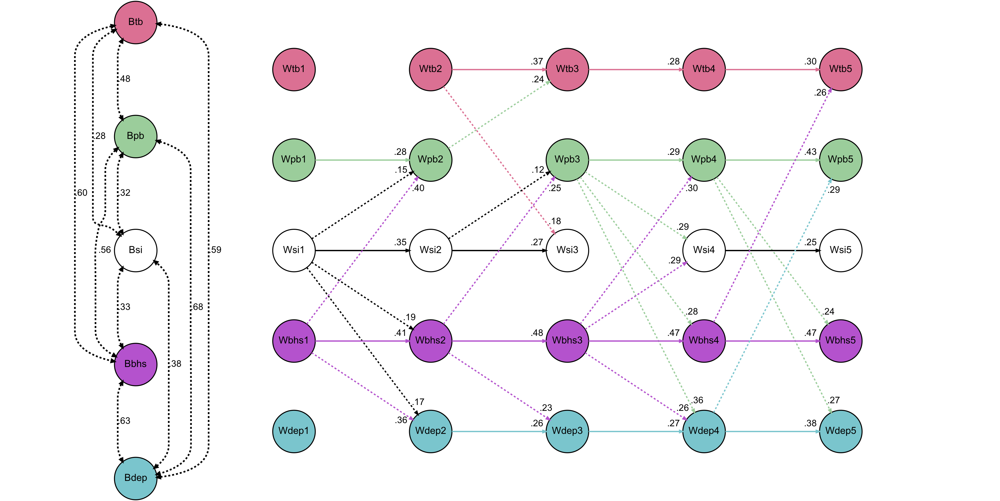

# Temporal exploration of the Interpersonal Theory of Suicide among adolescents during treatment

This repo contains `R` code used in the manuscript entitled: *"Temporal
exploration of the Interpersonal Theory of Suicide among adolescents during
treatment."* © 2022, American Psychological Association. This paper is not the
copy of record and may not exactly replicate the final, authoritative version of
the article.  Please do not copy or cite without authors' permission.  The final
article will be available, upon publication, via its DOI:
[10.1037/ccp0000758](https://doi.org/10.1037/ccp0000758).

Please note, due to privacy restrictions related to the [University of
Wollongong](https://uow.edu.au) Human Research Ethics Committee (Ethics Number:
HE14/376) approval for this study, no data is available in this repo to
reproduce the results reported in the manuscript. However, if you wish to access
the data used in this study, an application can be made to the data custodian
[Grand Pacific Health](https://gph.org.au). 

## Figures

## TODO

-  [x] Add manuscript `.Rmd` file.
-  [x] Add `func.R` script.
-  [x] Add `load.R` script.
-  [x] Add `data` dir and subdirs.
-  [x] Add `figures` dir.
-  [x] Add `bib` dir.
-  [x] Add `output` dir
-  [x] Add scripts related to data cleansing and analyses.
-  [x] Add figure `.png` file.
-  [x] Add `.bib` and `.csl` files.
